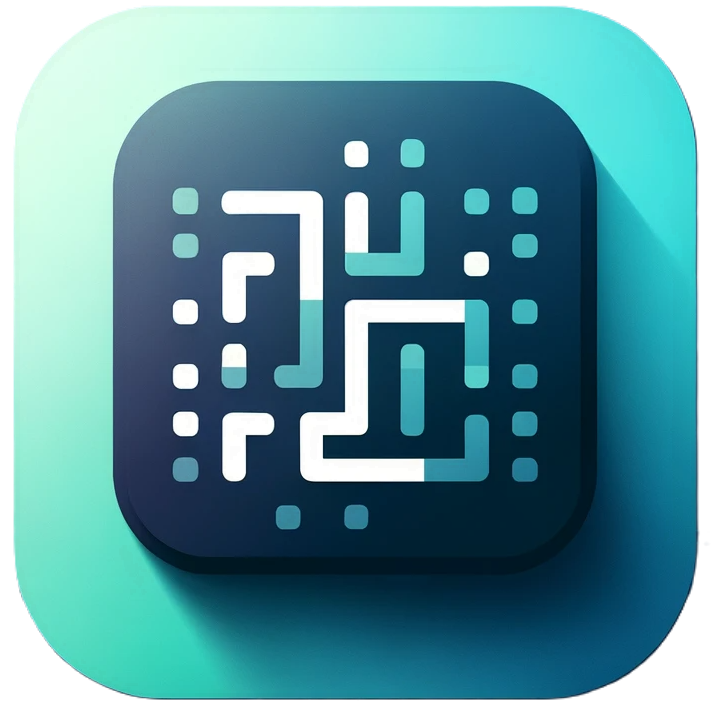
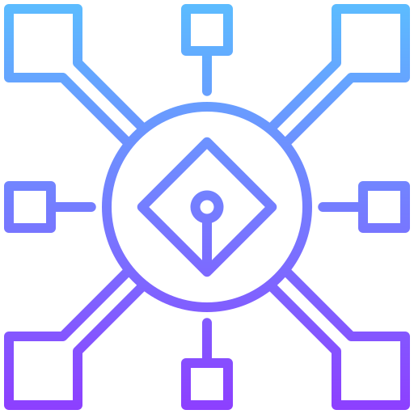
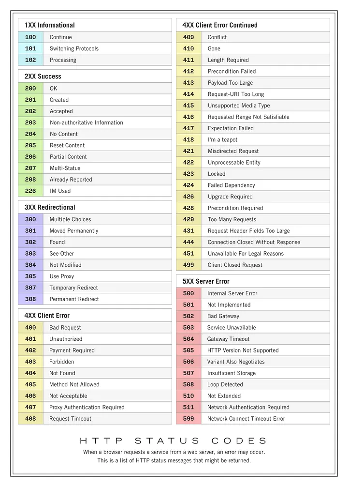

# Attributions

<!-- |  |  |  This is a section  -->

## Icons
All the icons used on this project are from [Flaticon](https://www.flaticon.com/).
| Description (Link) | Icon |
| ---- | ---- |
| [Data Server](https://www.flaticon.com/free-icon/data-server_7067790?term=network&page=1&position=65&origin=search&related_id=7067790) | 
|  |  |
| [favicon](./icons/favicon.png) |  |
| [simpler_icon](./icons/simpler_icon.png) |  |
| [centralized](./icons/centralized.png) |  |
|  |  |
| [AND gate](https://www.flaticon.com/free-icon/logic-gates_3512324?term=logic+gate&page=1&position=4&origin=search&related_id=3512324) | 
| [OR gate](https://www.flaticon.com/free-icon/logic-gates_3512387) | 
| [NOT gate](https://www.flaticon.com/free-icon/logic-gates_3512357?related_id=3512357) | 
| [NAND gate](https://www.flaticon.com/free-icon/logic-gates_3512140?term=logic+gate&page=1&position=25&origin=search&related_id=3512140) | 
| [NOR gate](https://www.flaticon.com/free-icon/logic-gates_3512348) | 
| [XOR gate](https://www.flaticon.com/free-icon/logic-gates_3512522) | 

## Images
| Description (Link) | Icon |
| ---- | ---- |
| [HTTP Status Codes](./img/http_status_codes.png) |  |
|  |  |

## Fonts
| Description (Link) | Icon |
| ---- | ---- |
|  |  |
